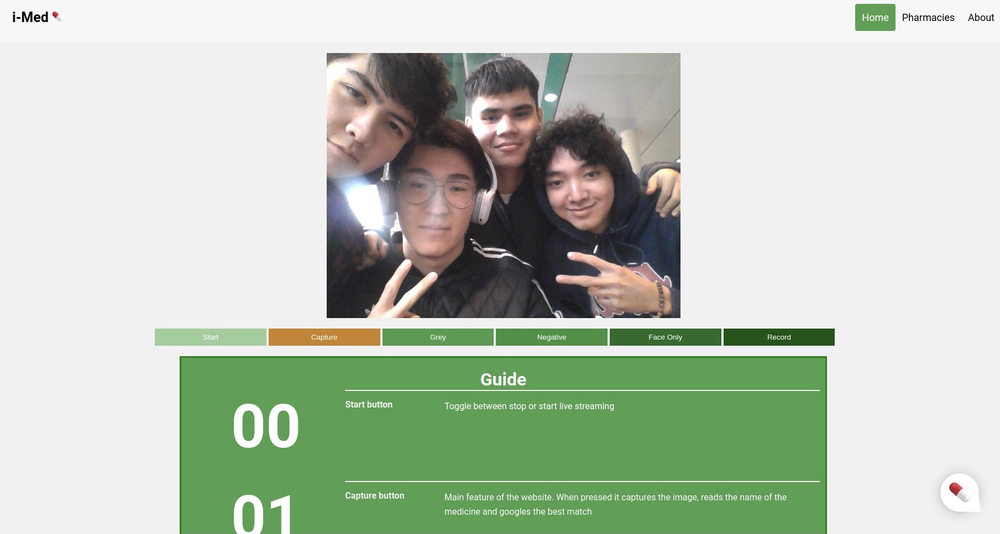
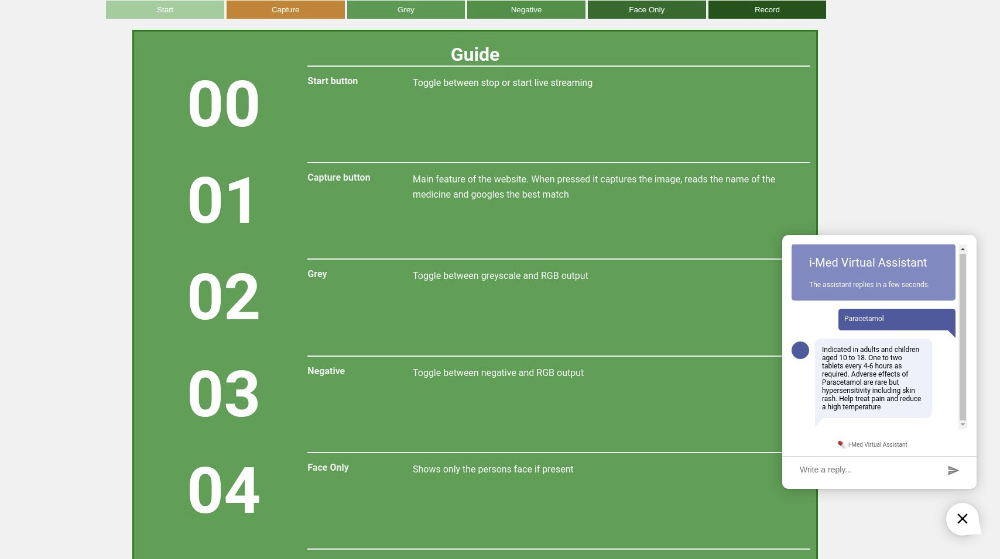

# i-Med

## About the project
i-Med: A medical portal for the general audience. This is a website. Computer Vision was integrated into the website using flask.

### Built with
* HTML
* CSS
* Javascript
* Python
* Flask - used for backend

## Screenshots

## Feautures
* A camera with several functions. The main function Capture captures the name of a medicine shown to the camera and googles the best match
* Chat widget to support customers
* Show nearby pharmacies based on your location
* Responsive UI

## Credits
* Muslim Bayemirov
* Assylbek Sakenov
* Timur Muzhikbayev